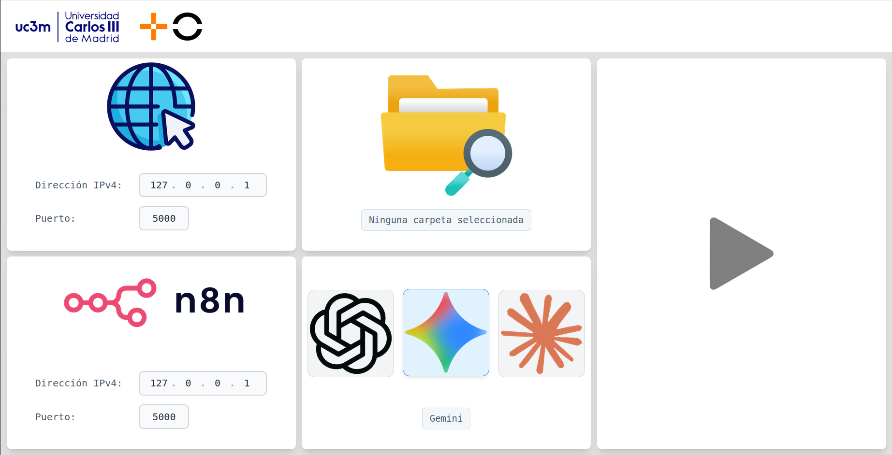

# TFM - Agente Validador de Hallazgos SAST

Este proyecto es el frontend de una herramienta diseñada para la validación de hallazgos de herramientas SAST en tiempo de ejecución, optimizando el flujo de trabajo de seguridad.

---

## Vista Previa





## Uso

1. **Clona el repositorio:**
   ```bash
   npm run dev

   npx electron .
